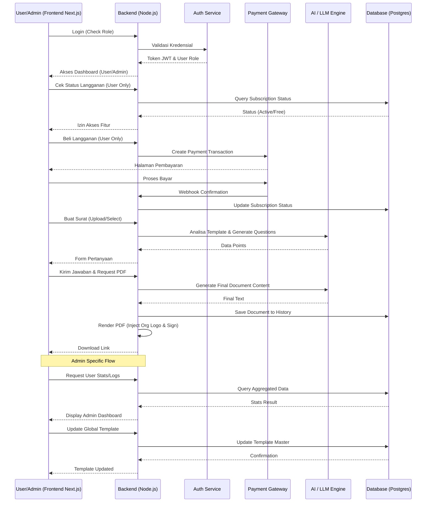

# PRD — Project Requirements Document

## 1. Overview
Banyak karyawan dan perusahaan merasa proses administratif pembuatan surat izin (seperti Work From Home, Cuti, Izin Sakit) masih manual, berulang, dan tidak terstandarisasi. Aplikasi ini dirancang sebagai solusi SaaS (Software as a Service) berbasis AI yang menyediakan platform cerdas untuk otomatisasi dokumen resmi. Pengguna dapat berbicara atau mengetik singkat untuk mengisi draf surat yang otomatis disesuaikan dengan template perusahaan. Sebagai produk SaaS, aplikasi ini menawarkan keamanan data, penyimpanan riwayat berbasis cloud, manajemen organisasi/perusahaan, serta fleksibilitas langganan untuk individu maupun tim bisnis. Sistem juga dilengkapi dengan Panel Administrasi untuk memastikan operasional platform berjalan lancar, memantau transaksi, dan mengelola konten global.

## 2. Requirements
*   **Sistem Autentikasi:** Wajib memiliki fitur Login, Register, dan Reset Password yang aman (Email/Password atau SSO Google).
*   **Manajemen Langganan (Subscription):** Tersedia beberapa tier plan (Free, Pro, Business) dengan batas penggunaan fitur yang berbeda (misal: jumlah dokumen per bulan).
*   **Payment Gateway:** Integrasi dengan penyedia pembayaran (Midtrans/Stripe) untuk transaksi langganan otomatis (recurring billing).
*   **Dukungan Bahasa:** Aplikasi dapat digunakan dalam Bahasa Indonesia dan Bahasa Inggris.
*   **Format Output:** Dokumen hasil akhir dapat diunduh dalam format PDF atau DOCX.
*   **Tanda Tangan Digital:** Pengguna dapat menggambar tanda tangan di layar yang tersimpan aman dan dapat digunakan kembali.
*   **Dashboard & Riwayat:** Pengguna memiliki dashboard pribadi untuk melihat, mengelola, dan mengunduh ulang dokumen yang pernah dibuat.
*   **Profil Organisasi:** Fitur untuk menyimpan detail perusahaan (Logo, Alamat, Kop Surat) agar otomatis tercetak di setiap dokumen.
*   **Dukungan Template:** Mampu membaca file template berbasis teks dari pengguna atau menggunakan template bawaan sistem.
*   **Panel Administrasi (Admin Panel):** Akses khusus bagi administrator internal untuk memantau kesehatan sistem, manajemen pengguna, verifikasi transaksi manual, dan pengelolaan template global.

## 3. Core Features
*   **Autentikasi & Manajemen Akun:**
    *   Registrasi/Login pengguna.
    *   Profil pengguna (Nama, Email, Foto).
    *   Pengaturan keamanan (Ganti password, 2FA opsional).
    *   Sistem Role (User biasa vs Admin).
*   **Manajemen Langganan & Billing:**
    *   Halaman Pricing untuk memilih plan.
    *   Integrasi Payment Gateway untuk checkout.
    *   Manajemen status langganan (Active, Expired, Cancelled).
*   **Dashboard User:**
    *   Ringkasan penggunaan (Sisa kuota dokumen).
    *   Riwayat dokumen (List surat yang pernah dibuat).
    *   Akses cepat untuk membuat surat baru.
*   **Pengaturan Organisasi/Perusahaan:**
    *   Upload logo perusahaan.
    *   Input alamat kantor, nomor telepon, dan detail kop surat default.
*   **Pilihan Mode Pembuatan Surat:** 
    *   *Surat Baru:* Pengguna memilih kategori surat (Sakit, WFH, Cuti, dll), lalu AI menyesuaikan format baku.
    *   *Upload Template:* Pengguna mengunggah template dari kantor (teks). AI bertugas menganalisa bagian mana saja yang perlu diisi.
*   **Sistem Tanya/Jawab Pintar (AI Prompter):** Berdasarkan template atau kategori surat, AI akan memunculkan formulir sederhana berupa pilihan ganda atau permintaan informasi detail.
*   **Input Suara (Voice Input) & Teks:** Fitur utama pelengkap di mana pengguna bebas menjawab permintaan informasi dari AI menggunakan suara (Voice-to-Text).
*   **Generator Dokumen Cerdas:** AI akan merangkai jawaban pengguna dan memasukkannya dengan gaya bahasa yang rapi ke dalam draf surat, termasuk menyisipkan kop surat organisasi.
*   **Tulis Layar Tanda Tangan (On-Screen Signature):** Kanvas digital bagi pengguna untuk membubuhkan tanda tangan yang tersimpan di profil untuk penggunaan berikutnya.
*   **Admin Dashboard & Manajemen Platform:**
    *   **Statistik Pengguna:** Grafik jumlah user aktif, pertumbuhan user baru, dan churn rate.
    *   **Manajemen Langganan:** Melihat daftar transaksi sukses/gagal, verifikasi manual jika webhook gagal, dan riwayat revenue (MRR).
    *   **Kontrol User:** Fitur untuk suspend, aktivasi kembali, atau reset akun pengguna yang bermasalah.
    *   **Pengelolaan Template Global:** Admin dapat menambah, mengedit, atau menghapus template bawaan sistem yang tersedia untuk semua user.

## 4. User Flow
1. **Auth (Login/Register):** Pengguna membuka aplikasi. Jika belum punya akun, mendaftar. Jika sudah, login.
2. **Onboarding & Langganan:** Pengguna baru diarahkan ke pemilihan Plan (Free/Pro). Jika memilih berbayar, lakukan pembayaran via Gateway.
3. **Dashboard:** Setelah login berhasil, pengguna masuk ke Dashboard utama (User atau Admin berdasarkan role).
4. **Setup Organisasi (Opsional):** Pengguna dapat mengisi detail perusahaan agar kop surat otomatis muncul.
5. **Mulai Buat Surat:** Pengguna menekan tombol "Buat Surat Baru".
6. **Pilih Jalur:** Pilih "Template Bawaan" atau "Upload Template Sendiri".
7. **Isi Data (Voice/Klik):** AI memunculkan pertanyaan. Pengguna menjawab via suara atau teks.
8. **Review Draf:** Teks surat ditampilkan. Pengguna dapat mengedit manual jika perlu.
9. **Tanda Tangan:** Pengguna membubuhkan tanda tangan (bisa pilih yang sudah tersimpan atau gambar baru).
10. **Selesai & Ekspor:** Sistem menghasilkan PDF/DOCX. Dokumen tersimpan di Riwayat Dashboard. Pengguna bisa Download atau Share.

**Admin Flow:**
1. **Admin Login:** Administrator login menggunakan kredensial khusus (role=ADMIN).
2. **Admin Dashboard:** Langsung diarahkan ke panel statistik utama (Total User, Revenue, System Health).
3. **Manajemen User:** Admin memilih menu User List untuk melihat detail, melakukan suspend, atau reset password user.
4. **Manajemen Transaksi:** Admin memeriksa log pembayaran, terutama yang statusnya pending atau failed untuk verifikasi manual.
5. **Manajemen Template:** Admin mengakses menu Template Global untuk menambah atau memperbarui template surat standar sistem.

## 5. Architecture
Aplikasi ini menggunakan arsitektur *Client-Server* dengan pendekatan SaaS Multi-tenant (berbasis Organisasi/User). Frontend menangani UI dan interaksi pengguna. Backend menangani logika bisnis, autentikasi, pembayaran, dan integrasi AI. Terdapat dua jenis klien: User App dan Admin Panel.



## 6. Database Schema
Skema database dirancang untuk mendukung multi-tenancy sederhana (User & Organisasi), manajemen langganan, dan riwayat dokumen permanen.

```mermaid
erDiagram
    USER ||--o{ ORGANIZATION : "milik / admin"
    USER ||--o{ DOCUMENT : "membuat"
    USER ||--o| SUBSCRIPTION : "memiliki"
    ORGANIZATION ||--o{ DOCUMENT : "template default"
    SUBSCRIPTION ||--| PAYMENT_TRANSACTION : "riwayat bayar"

    USER {
        uuid id PK
        varchar email "Unique"
        varchar password_hash
        varchar full_name
        varchar avatar_url
        varchar role "USER, ADMIN"
        timestamp created_at
    }

    ORGANIZATION {
        uuid id PK
        varchar name "Nama Perusahaan"
        text address
        varchar logo_url
        uuid owner_id FK "User pembuat org"
    }

    SUBSCRIPTION {
        uuid id PK
        uuid user_id FK
        varchar plan_type "FREE, PRO, BUSINESS"
        timestamp current_period_start
        timestamp current_period_end
        varchar status "ACTIVE, CANCELLED"
        varchar payment_gateway_id
    }

    PAYMENT_TRANSACTION {
        uuid id PK
        uuid subscription_id FK
        varchar gateway_transaction_id
        varchar amount
        varchar currency
        varchar status "PENDING, SUCCESS, FAILED"
        timestamp paid_at
    }

    DOCUMENT {
        uuid id PK
        uuid user_id FK
        uuid organization_id FK "Opsional"
        varchar document_type
        text final_content
        text signature_data
        varchar file_url "Path ke storage"
        timestamp created_at
    }
```

**Penjelasan Tabel Utama:**
1. **`USER`**: Menyimpan data akun pelanggan dan administrator. Kolom `role` menentukan akses (USER biasa atau ADMIN).
2. **`ORGANIZATION`**: Menyimpan profil perusahaan (Kop surat, logo) agar surat terlihat resmi sesuai instansi pengguna.
3. **`SUBSCRIPTION`**: Menyimpan status langganan aktif pengguna untuk membatasi atau membuka fitur (Freemium model).
4. **`PAYMENT_TRANSACTION`**: Mencatat riwayat pembayaran untuk audit dan verifikasi langganan.
5. **`DOCUMENT`**: Menyimpan hasil surat yang sudah jadi secara permanen di cloud, terikat pada User dan Organisasi.

## 7. Tech Stack
Berikut adalah rekomendasi teknologi untuk pengembangan berbasis SaaS:

*   **Frontend (UI/UX):** **Next.js 14+ (App Router)**. Framework React ini sangat disarankan untuk SaaS karena mendukung Server Side Rendering (SEO), autentikasi yang lebih aman, dan performa tinggi. Styling menggunakan **Tailwind CSS** & **shadcn/ui**. Admin Panel akan menggunakan komponen yang sama dengan akses berbasis role.
*   **Backend (Server):** **Node.js** dengan **NestJS** atau **Express.js**. Struktur modular NestJS disarankan untuk skalabilitas SaaS.
*   **Database:** **PostgreSQL**. Dihubungkan menggunakan **Prisma ORM** atau **Drizzle ORM** untuk manajemen tipe data yang aman dan migrasi mudah.
*   **Authentikasi:** **NextAuth.js** atau **Clerk**. Mengelola sesi login, password hashing, dan integrasi social login (Google) dengan aman. Mendukung role-based access control (RBAC).
*   **Payment Gateway:** **Midtrans** (untuk pasar Indonesia) atau **Stripe** (Internasional). Menggunakan webhook untuk update status langganan otomatis.
*   **AI Engine:** **OpenAI API (GPT-4o-mini)**. Untuk analisis template dan generation teks surat.
*   **File Storage:** **AWS S3** atau **Google Cloud Storage**. Untuk menyimpan logo organisasi, tanda tangan, dan file PDF/DOCX hasil generate.
*   **Deployment:** **VPS** (DigitalOcean/Linode) atau **Cloud Platform** (Vercel untuk Frontend, Railway/Render untuk Backend). Menggunakan **Docker** untuk konsistensi lingkungan backend dan database.
*   **Email Service:** **Resend** atau **SendGrid**. Untuk pengiriman email transaksi (Invoice, Reset Password, Welcome Email).